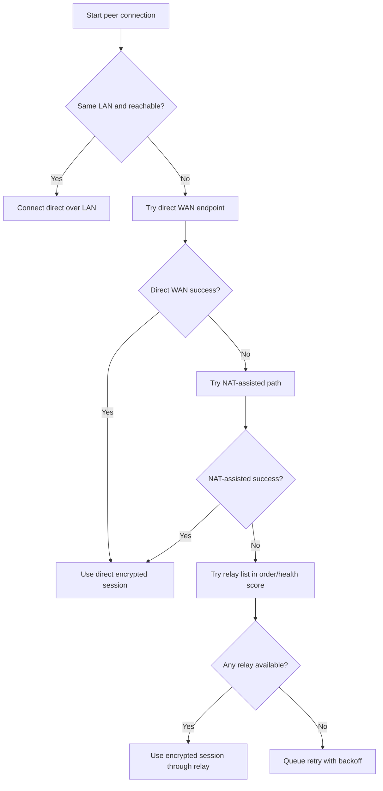
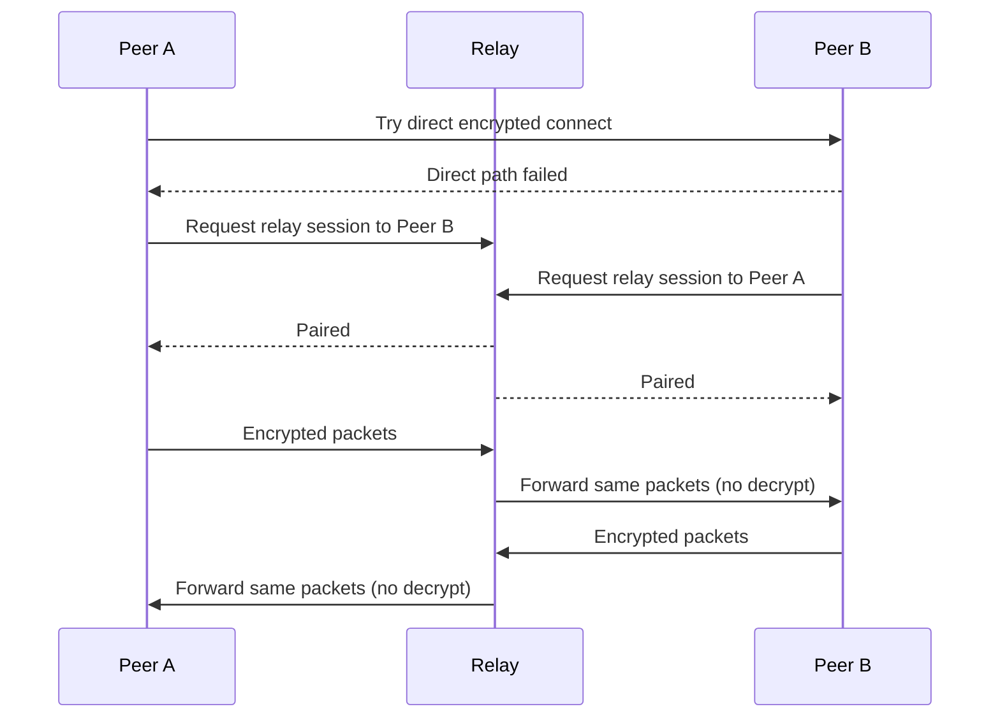
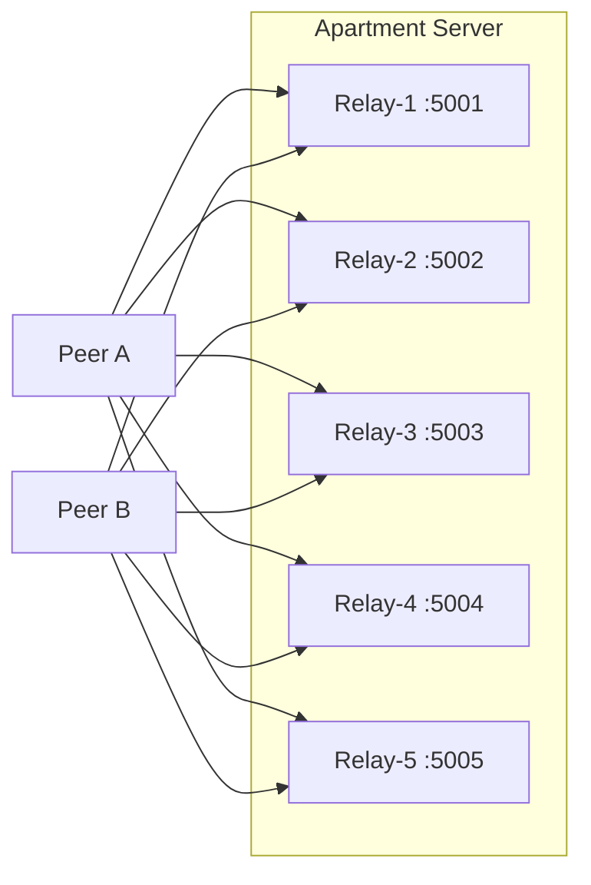

# Zer0Talk Relay + Peer Connectivity (One-Relay Testing Guide)

## Why this document exists
You do **not** need to rent 5 servers to prove the architecture works.

This guide explains, in plain English:
- how peer-to-peer and relay paths work together,
- why relay is fallback only,
- what happens if a relay goes down,
- and how to test multi-relay behavior using one local server.

---

## The simple model (plain English)
Think of Zer0Talk like this:

1. Peers always try to connect directly first.
2. If direct connection fails (usually NAT/firewall issues), they try relay.
3. Relay only forwards encrypted traffic. It cannot read message contents.
4. If a relay is down, clients try the next relay in the list.
5. If no relay works and direct path is impossible, the connection waits and retries later.

So the rule is:
- **Direct-first** for speed and privacy.
- **Relay-only-as-fallback** for reliability.

---

## Visual: connection decision flow


---

## Visual: what “blind relay” means


Relay sees metadata needed to route (session IDs, connection state), but not plaintext message content.

---

## “If I only have one relay, how can I test multi-relay logic?”
You can simulate 5 relays on one machine by running 5 instances on different ports.

Example logical relay pool on one apartment server:
- `192.168.1.50:5001`
- `192.168.1.50:5002`
- `192.168.1.50:5003`
- `192.168.1.50:5004`
- `192.168.1.50:5005`

Even though they are on one host, this still validates:
- client failover order,
- timeout behavior,
- retry/backoff logic,
- health scoring,
- and “try next relay” code paths.

What it does **not** fully validate:
- real geographic latency,
- real ISP/regional routing differences,
- real provider-level outages.

But for functional correctness, one host with many ports is enough.

---

## Visual: one physical host, many logical relays


---

## Test plan you can run today (low cost)

### Test 1: Direct-first still works
- Put two peers on same LAN.
- Confirm they connect directly without touching relay.
- Expected: relay usage = 0 for this session.

### Test 2: Force relay fallback
- Block direct path between two peers (firewall rule or NAT constraint).
- Keep one relay instance up.
- Expected: direct fails, relay succeeds.

### Test 3: Multi-relay failover with one host
- Configure 5 relay endpoints (5 ports on your one server).
- Stop relay on `:5001` and `:5002`; keep `:5003` up.
- Expected: client skips failed relays and connects via `:5003`.

### Test 4: Relay outage behavior
- Keep direct path impossible and stop all relay instances.
- Expected: connection does not establish, app queues retries with backoff (no crash, no infinite tight loop).

### Test 5: Recovery behavior
- Bring one relay instance back up.
- Expected: next retry succeeds without app restart.

---

## What happens if relay goes down outside LAN?
If peers cannot connect directly and every relay is down, there is no transport path at that moment.

That is normal for any fallback architecture.

The app should then:
1. keep messages encrypted and queued,
2. retry using backoff,
3. reconnect automatically when a direct path or a relay becomes available.

---

## “Do we need a domain name?”
No, not required.

You can run with:
- raw IP + port (`203.0.113.10:5001`), or
- local DNS / dynamic DNS later if you want convenience.

Domain names help usability, but they are not a technical requirement for relay fallback.

---

## Router + Firewall quick setup (port range)

If your router has a small limit on the number of forwarding rules, use **one port range** rule.

Example setup for 5 logical relays on one server:
- Relay host LAN IP: `192.168.1.50`
- Port range: `5001-5005` (TCP)

Router rule (single rule):
- Protocol: TCP
- External start/end: `5001` / `5005`
- Internal IP: `192.168.1.50`
- Internal start/end: `5001` / `5005`

Windows Firewall (run PowerShell as Administrator on relay host):

```powershell
New-NetFirewallRule -DisplayName "Zer0Talk Relay TCP 5001-5005" -Direction Inbound -Action Allow -Protocol TCP -LocalPort 5001-5005
```

Verify listeners on relay host:

```powershell
Get-NetTCPConnection -State Listen | Where-Object { $_.LocalPort -ge 5001 -and $_.LocalPort -le 5005 } | Select-Object LocalAddress,LocalPort,OwningProcess
```

Verify from another machine on your LAN:

```powershell
Test-NetConnection 192.168.1.50 -Port 5001
Test-NetConnection 192.168.1.50 -Port 5002
Test-NetConnection 192.168.1.50 -Port 5003
Test-NetConnection 192.168.1.50 -Port 5004
Test-NetConnection 192.168.1.50 -Port 5005
```

Notes:
- Some routers call this "virtual server", "NAT rule", or "port mapping".
- If your ISP uses CGNAT, inbound forwarding from public internet may not work even if router rules are correct.
- For local functional tests, LAN validation is enough to prove relay failover logic.

---

## Practical recommendation for your situation
For now, use this staged approach:
1. **One server, multiple relay ports** to validate logic.
2. Add lightweight uptime checks and logs for relay selection/failover.
3. Only later, if needed, add one cheap external relay for real-world WAN validation.

This gives you confidence in behavior **without** paying for five servers.

---

## Acceptance checklist
Use this to decide if the system is ready:
- Direct connection is attempted before any relay.
- Relay is used only when direct paths fail.
- Relay failover tries next endpoint automatically.
- Total relay outage degrades gracefully (queued + retry), not crash.
- Recovery is automatic when any path returns.

If all five are true, the architecture is working as intended.
